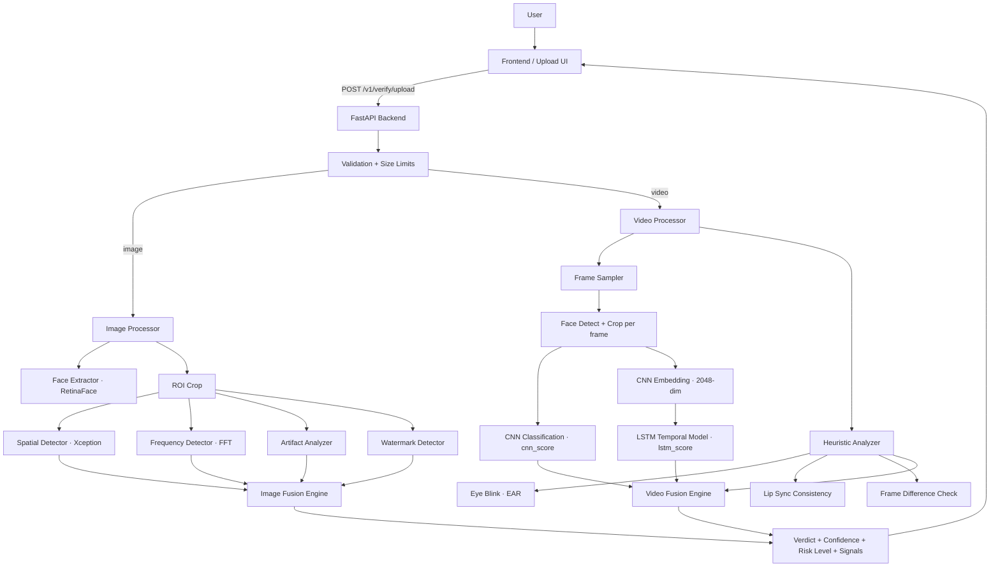

# VeriRiskAI

VeriRiskAI is a batch-only KYC verification system that accepts a selfie image or short video and returns a deepfake verdict with confidence, risk level, and a full signal breakdown. The system avoids real-time streaming and challenge-response logic.

---

## System Architecture

### End-to-End Flow



### Video Pipeline — Detailed Stages

```
Video Bytes
    |
    v
[1] Frame Extraction        (OpenCV — sampled evenly across clip)
    |
    v
[2] Face Detection + Crop   (InsightFace/RetinaFace per frame)
    |
    v
[3] Face Preprocessing      (resize to 224x224, JPEG encode)
    |
    +-----> [4a] CNN Classification  --> cnn_score (avg across frames)
    |
    +-----> [4b] CNN Embedding (head removed, 2048-dim feature vector)
                    |
                    v
              [5] LSTM Temporal Model --> lstm_score
                  (neutral 0.5 until trained weights are loaded)
    |
    v
[6] Heuristic Analyzer
    ├── Eye Blink Detection (EAR via MediaPipe FaceLandmarker) --> blink_score
    ├── Lip Sync Consistency (mouth ratio variance)            --> lip_score
    └── Frame Difference Check (pixel absdiff, always active) --> frame_diff_score
                                                               --> heuristic_score
    |
    v
[7] Score Fusion
    final_score = 0.50 * cnn_score
               + 0.30 * lstm_score   (0.5 neutral when untrained)
               + 0.20 * heuristic_score
    |
    v
[8] Verdict + Risk Level + All Sub-scores
```

---

## API Contract

- **Base path:** `/v1`
- **Endpoint:** `POST /v1/verify/upload`
- **Request body:**

```json
{
  "user_id": "string",
  "input_type": "image | video",
  "file": "<base64-encoded file>"
}
```

- **Response:**

```json
{
  "verdict": "ACCEPT | REVIEW | REJECT",
  "confidence": 0.82,
  "risk_level": "LOW | MEDIUM | HIGH",
  "final_score": 0.18,
  "signals": {
    "spatial_fake_score": 0.85,
    "frequency_fake_score": 0.72,
    "temporal_score": 0.50,
    "behavioral_score": 0.60,
    "cnn_score": 0.85,
    "lstm_score": 0.50,
    "heuristic_score": 0.60,
    "blink_score": 0.70,
    "lip_score": 0.55,
    "frame_diff_score": 0.60
  },
  "flags": {
    "artifact_flag": true,
    "frequency_anomaly": true,
    "temporal_inconsistency": false,
    "watermark_detected": false
  },
  "fusion_components": {
    "cnn_score": 0.85,
    "lstm_score": 0.50,
    "heuristic_score": 0.60,
    "weights": { "cnn": 0.5, "lstm": 0.3, "heuristic": 0.2 }
  }
}
```

> **Note:** `risk_level`, `final_score`, `fusion_components`, and the advanced `signals` fields (`lstm_score`, `heuristic_score`, `blink_score`, `lip_score`, `frame_diff_score`) are present **for video inputs only**. Image inputs return `null` for these fields.

The canonical OpenAPI spec lives in [backend/openapi.yaml](backend/openapi.yaml).

---

## Risk Levels

| Final Score | Risk Level | Verdict |
|-------------|------------|---------|
| > 0.70 | **HIGH** | REJECT |
| 0.40 – 0.70 | **MEDIUM** | REVIEW |
| < 0.40 | **LOW** | ACCEPT |

---

## Model and Signal Details

### Spatial Detector (Xception CNN)

- Model: `timm legacy_xception` with a single-logit classification head.
- Weights: `backend/models/deepfake_model_xception.pth` (set via `SPATIAL_MODEL_PATH`).
- Input: 224×224 RGB, ImageNet normalisation.
- Output (detect): fake probability score (0–1).
- Output (embedding): 2048-dim L2-normalised feature vector (used as LSTM input).

### Frequency Detector

- FFT-based frequency energy analysis with radial profiling for GAN-characteristic irregularities.

### LSTM Temporal Model

- Architecture: Bidirectional 2-layer LSTM, input_size=2048, hidden_size=256.
- Input: sequence of per-frame CNN embeddings extracted from the Xception backbone.
- **Status:** Integrated. The trained model weights (`lstm_forensics.pth`) are actively configured and used by the pipeline to detect deepfake synthesis artifacts over time.

### Heuristic Analyzer

Three independent sub-checks combined into `heuristic_score`:

| Check | Method | Always Active |
|-------|--------|--------------|
| Frame Difference | Pixel-level absdiff, spike/frozen detection | ✅ Yes |
| Eye Blink (EAR) | MediaPipe FaceLandmarker + EAR formula | After model download |
| Lip Sync | Mouth ratio variance across frames | After model download |

### Artifact Analyzer

- Edge-boundary cues and visual artifact heuristics (Canny-based analysis).

### Watermark Detector

- Heuristic watermark presence and score.

---

## Local Development

### Backend (Windows)

```powershell
cd backend
python -m venv venv
.\venv\Scripts\activate
pip install -r requirements.txt
uvicorn app.main:app --reload --app-dir .
```

Server runs at: http://127.0.0.1:8000
Interactive docs: http://127.0.0.1:8000/docs

### Frontend

```bash
cd frontend
npm install
npm run dev
```

---

## Optional Setup (Unlocks Full Heuristics)

### Enable Blink + Lip-Sync Detection

Download the MediaPipe FaceLandmarker model once (~3 MB):

```powershell
cd backend
python scripts/download_mediapipe_model.py
```

This places `backend/models/face_landmarker.task`. The server auto-detects it on next startup.

---

## Configuration

Environment variables (see `backend/.env.example`):

| Variable | Default | Description |
|---|---|---|
| `SPATIAL_MODEL_PATH` | `backend/models/deepfake_model_xception.pth` | Xception CNN weights |
| `LSTM_MODEL_PATH` | `None` | LSTM weights (neutral fallback if unset) |
| `MEDIAPIPE_FACE_MODEL` | `backend/models/face_landmarker.task` | FaceLandmarker model path |
| `FUSION_XGB_MODEL_PATH` | `None` | Optional XGBoost fusion model |
| `LOG_LEVEL` | `INFO` | Logging verbosity |

---

## Validation

Run the pipeline smoke-test (no extra model files required):

```powershell
cd backend
python scripts/e2e_no_lstm.py
```

Expected output: **6/6 checks passed**

---

## Constraints

- No live streaming.
- No challenge-response engine.
- Entire pipeline runs as batch processing on upload.
- Max image upload: 2 MB. Max video upload: 15 MB.
- Allowed image formats: JPEG, PNG. Allowed video formats: MP4, WEBM.
