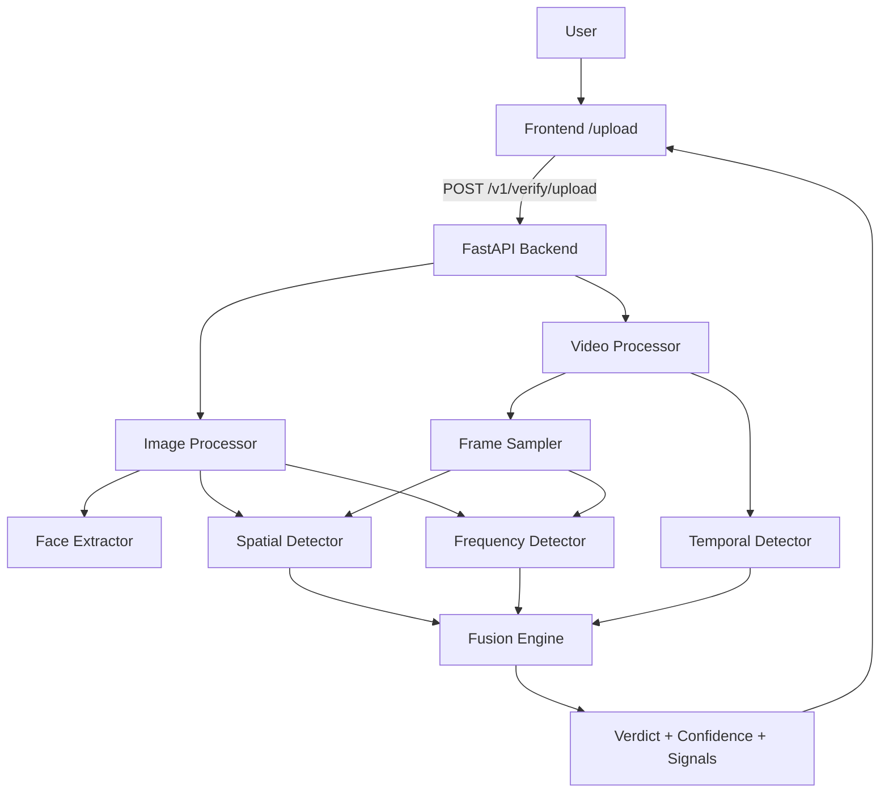

# VeriRiskAI System Architecture

## Overview
VeriRiskAI is a batch-only KYC verification system that accepts a single selfie image or a short video upload and returns a deepfake detection verdict with confidence and signal breakdown. The system avoids real-time streaming and challenge-response logic.

## High-Level Architecture

## Backend Components
- **API**: `POST /v1/verify/upload` accepts base64 image/video and returns verdict, confidence, and signals.
- **Image Processor**: Runs face extraction, spatial deepfake detection, and frequency analysis.
- **Video Processor**: Samples frames, runs per-frame spatial/frequency checks, and computes temporal consistency.
- **Fusion Engine**: Aggregates signals and determines verdict and confidence.
- **Validation**: Base64 validation for image/video, size limits, and basic format checks.

## Frontend Components
- **/upload**: Upload-only UI with user id, input type selection, and file chooser.
- **/processing**: Displays processing state after submission.
- **/results** and **/kyc/result**: Display verdict, confidence, and signal breakdown.

## Data Flow (Batch Only)
1. User selects input type and uploads a file in the frontend.
2. Frontend sends base64 payload to `/v1/verify/upload`.
3. Backend validates payload and routes to image or video processor.
4. Signals are fused into a verdict and confidence score.
5. Response is returned to the frontend for display.

## Key Constraints
- No live frame streaming.
- No real-time capture logic.
- No challenge-response engine.
- Entire pipeline runs as batch processing on upload.
