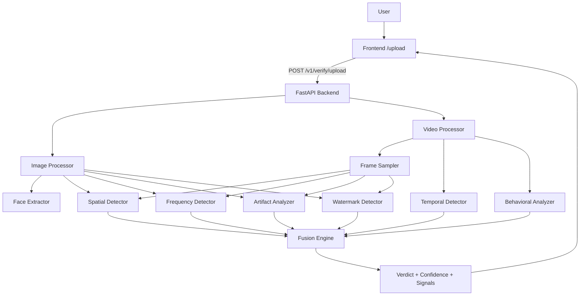
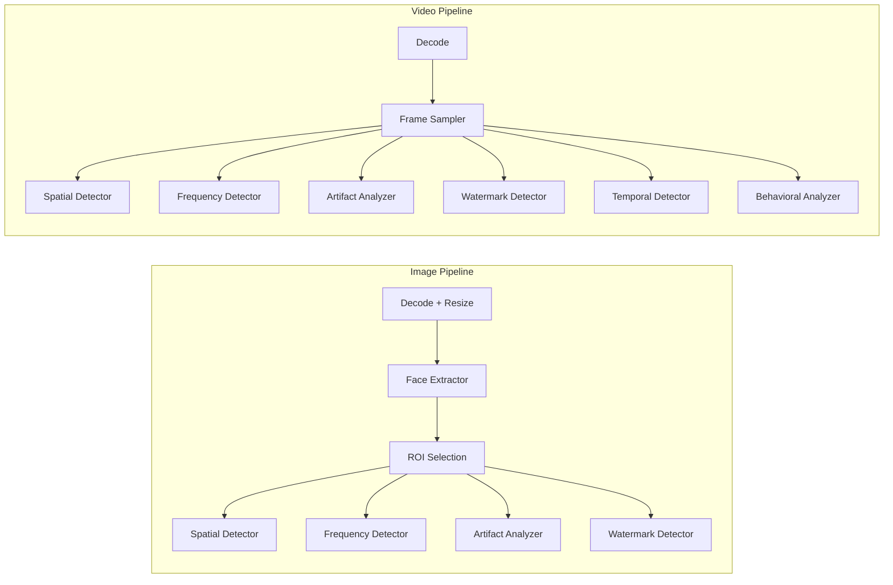

# VeriRiskAI

VeriRiskAI is a batch-only KYC verification system that accepts a selfie image or short video and returns a deepfake verdict with confidence and signal breakdown. The system avoids real-time streaming and challenge-response logic.

## System Architecture



## Backend Pipeline (Image vs Video)



## Frontend User Flow


## API Contract

- Base path: `/v1`
- Endpoint: `POST /v1/verify/upload`
- Request: `{ user_id, input_type, file }` where `file` is base64
- Response: `verdict`, `confidence`, `signals`, `flags`

`signals` includes:
- `spatial_fake_score`
- `frequency_fake_score`
- `temporal_score` (video only)
- `behavioral_score` (video only)

`flags` includes:
- `artifact_flag`
- `frequency_anomaly`
- `temporal_inconsistency`
- `watermark_detected`

The canonical OpenAPI spec lives in [backend/openapi.yaml](backend/openapi.yaml).

## Current Detector Status

- Spatial: stub (returns constant score)
- Frequency: FFT-based
- Temporal: frame MSE + spike scoring (video only)
- Behavioral: motion consistency (video only)
- Artifact: heuristic edge/texture cues
- Watermark: heuristic score + flag
- Face detection: RetinaFace via InsightFace

## Local Development

### Backend

From repo root:

```bash
cd backend
python -m venv venv
source venv/bin/activate
pip install -r requirements.txt
uvicorn app.main:app --reload --app-dir .
```

### Frontend

```bash
cd frontend
npm install
npm run dev
```

## Configuration

Environment variables (see `backend/.env.example`):
- `LOG_LEVEL`
- `FUSION_XGB_MODEL_PATH`
- `SPATIAL_MODEL_URL`
- `SPATIAL_MODEL_PATH`

## Constraints

- No live streaming.
- No challenge-response engine.
- Entire pipeline runs as batch processing on upload.
