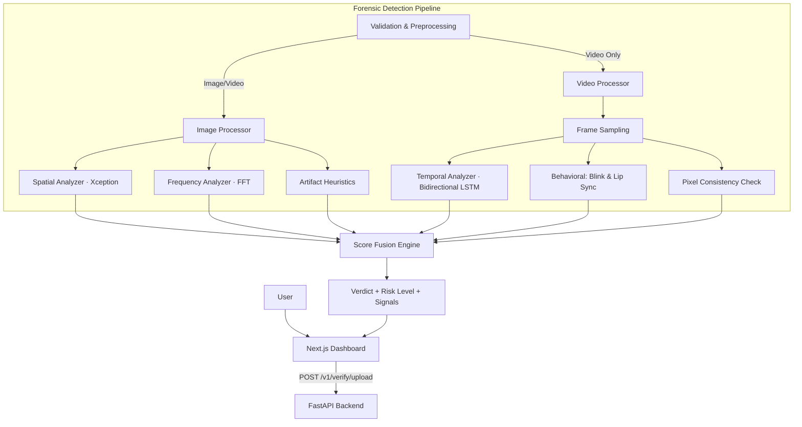

# VeriRiskAI — Forensic-Grade Deepfake Detection & KYC Verification

[](https://fastapi.tiangolo.com/)
[](https://nextjs.org/)
[](https://www.python.org/)
[](https://www.typescriptlang.org/)

VeriRiskAI is a high-precision, batch-processing KYC verification system designed to detect deepfakes and synthetic media in images and videos. By utilizing a multi-layered forensic pipeline, it provides a comprehensive risk assessment, transparency through explainable AI signals, and a modern forensic dashboard for analysis.

---

## 🚀 Key Features

- **Multi-Layered Detection Engine**: Combines spatial, frequency, and temporal analysis with behavioral heuristics.
- **Explainable AI (XAI)**: Returns confidence scores, risk levels (LOW, MEDIUM, HIGH), and granular signals for every detection layer.
- **Forensic Behavioral Analysis**: Detects eye-blink patterns (EAR), lip-sync consistency, and frame-level pixel inconsistencies.
- **Batch Processing**: Optimized for asynchronous upload-based verification, avoiding the pitfalls of real-time streaming in high-latency environments.
- **Modern Dashboard**: A premium Next.js interface with real-time progress tracking, forensic frame inspection, and timeline visualizations.

---

## 🛠️ Technological Stack

### Backend (Forensic Core)
- **FastAPI**: High-performance Python API framework.
- **Computer Vision**: OpenCV, MediaPipe FaceLandmarker.
- **Deep Learning**: 
  - **Spatial**: Xception CNN (timm legacy_xception) for frame-level classification.
  - **Temporal**: Bidirectional LSTM for sequence-based synthesis detection.
- **Frequency Analysis**: FFT-based energy profiling to detect GAN/Diffusion artifacts.

### Frontend (Analysis UI)
- **Next.js 14**: Modern React framework for high-speed user interfaces.
- **Styling**: Tailwind CSS with Framer Motion and GSAP for fluid, premium animations.
- **State Management**: Zustand for efficient global state handling.

---

## 🏗️ System Architecture

VeriRiskAI operates as an end-to-end forensic pipeline, from ingestion to verdict fusion.



---

## 🚦 Getting Started

### Prerequisites
- Python 3.10+
- Node.js 18+
- npm or yarn

### 1. Clone the Repository
```bash
git clone https://github.com/rayyanshaikh123/VeriRiskAI.git
cd VeriRiskAI
```

### 2. Backend Setup
```powershell
cd backend
python -m venv venv
.\venv\Scripts\activate
pip install -r requirements.txt
# (Optional) Download MediaPipe models for heuristics
python scripts/download_mediapipe_model.py
uvicorn app.main:app --reload --app-dir .
```
> [!NOTE]
> The backend will run on `http://127.0.0.1:8000`. Access interactive API docs at `/docs`.

### 3. Frontend Setup
```bash
cd frontend
npm install
npm run dev
```
> [!NOTE]
> The dashboard will be available at `http://localhost:3000`.

---

## 📊 Detection Layers & Heuristics

VeriRiskAI doesn't rely on a single model. It fuses multiple forensic "signals" to reach a verdict:

| Layer | Method | Targeted Artifacts |
| :--- | :--- | :--- |
| **Spatial** | CNN (Xception) | Blending boundaries, texture inconsistencies. |
| **Frequency** | FFT Energy | Upsampling artifacts, GAN-specific noise. |
| **Temporal** | Bi-LSTM | Frame-to-frame jitters, unnatural transitions. |
| **Blink (EAR)** | MediaPipe | Lack of natural eye blinking (Eye Aspect Ratio). |
| **Lip Sync** | Mouth ROI Var | Mismatch between audio/visual speech cues. |

---

## 📜 API Overview

The canonical OpenAPI specification can be found in `backend/openapi.yaml`.

### Verification Upload
`POST /v1/verify/upload`

**Request:**
```json
{
  "user_id": "string",
  "input_type": "image | video",
  "file": "<base64_encoded_payload>"
}
```

**Verdict Logic:**
- **LOW RISK (< 0.40)**: ✅ ACCEPT
- **MEDIUM RISK (0.40 - 0.70)**: ⚠️ REVIEW
- **HIGH RISK (> 0.70)**: ❌ REJECT

---

## 📄 License

VeriRiskAI is developed for KYC forensic analysis. See the repository for specific licensing details.

---
*Created with ❤️ by the Compile Crew Team.*
